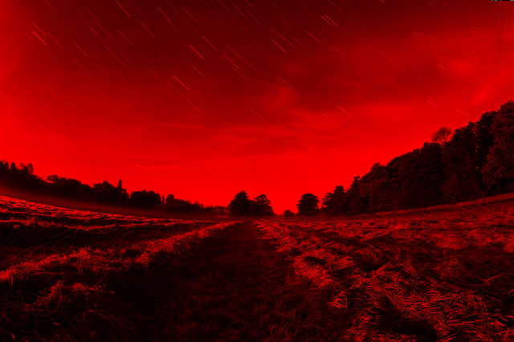
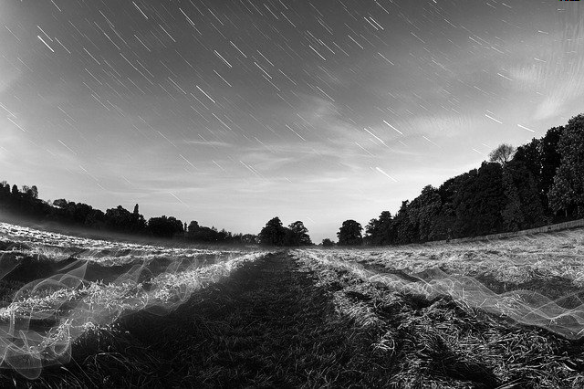

# bmp-image-filter
## Filtro de imagens BMP que gera quatro arquivos de saída

# Como funciona?
O programa basicamente recebe uma imagem BMP, e gera quatro arquivos, três deles com apenas um canal de cor (vermelho, verde e azul), e o outro em escala de cinza.
Exemplo da imagem de entrada:

Exemplo das imagens de saída:

